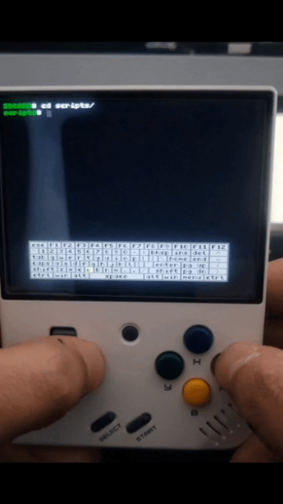
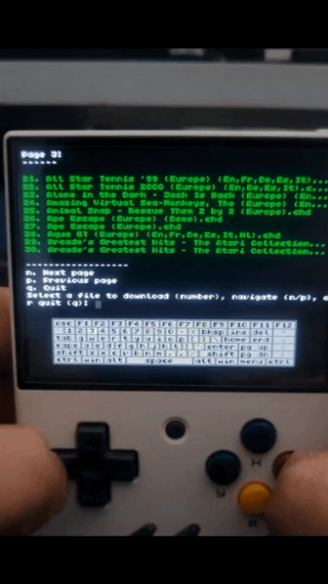

# PSX CHD Downloader

This `sh` shell script allows you to download `.CHD` files of PlayStation (PSX) games from the Internet Archive. **It is designed to be run on OnionOS for the Miyoo Mini Plus**, but it should also work for systems that support bash scripting.

The script displays a paginated list of available files, allows you to download the ones you choose and stores them in `../Roms/PS`.

It has a source selector, currently supports a European and US sources.


# Requirements

* Miyoo with Wi-Fi connection (Miyoo Plus).
* OnionOS installed on the Miyoo.
* Terminal app installed on your OnionOS system.

# Installation and Run

* Download the file [download_psx.sh](https://github.com/vzepec/miyoo_downloader_psx/blob/main/download_psx.sh).
* Connect your Miyoo's micro SD card to your computer.
* Create a folder on the micro SD card called `scripts` and place the `download_psx.sh` file inside.
* Connect the micro SD card to your Miyoo and open the Terminal app.
* Navigate to the `scripts` folder with the following command:
```bash
  cd scripts
```
* Assign execution permissions with the following command (Only the first time):
```bash
  chmod 755 download_psx.sh
```

* Run the `download_psx.sh` file with the following command:
```bash
  ./download_psx.sh
```
# Usage and Download

When you run the script, a source selector will appear where you can choose:

- European source
- USA source
- Both

After that, the first page of `.chd` files will appear, numbered from 1 to 10. You can do the following:

- Navigate between pages by typing the letter `n` (Next page) or go back to a previous page by typing `p`.

- Download a game file by typing its corresponding number.

- Back to the source selector menu `m` (Menu).

- Close the script by typing the letter `q` (Quit).

**Important** After downloading a file, remember to refresh the list of ROMs by going to the Games section and pressing the  `Select` button.

## Future Enhancements 🔥

* Search by name 
* More sources
* Code optimization

## Demo





## 🚀 Author

- [@vzepec](https://github.com/vzepec)

Thank you!
